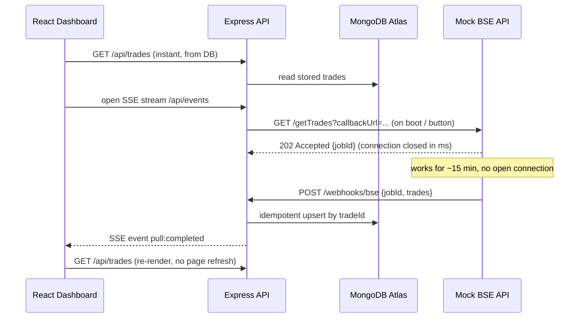

# Architecture Note

## Problem

A BSE pull takes up to **15 minutes**, but the network kills any HTTP connection open for **more than 30 seconds**.
So no request may wait for a pull, and the UI must show data instantly while a pull is running.

## Design: async job + webhook + store + push



```text
 Browser (React) --REST--> Express API <--webhook-- Mock BSE
        ^  \--SSE (push)--/    |
        |                      v
        +------------------- MongoDB Atlas (trades, pulls)
```

## Why this design

| Requirement | How it is met |
|---|---|
| Connections < 30 s | BSE replies `202` instantly and calls back via **webhook**; nobody holds a connection for 15 minutes. SSE streams are recycled every 25 s and `EventSource` reconnects automatically. |
| Dashboard opens instantly | Trades are persisted in MongoDB Atlas; the dashboard reads the DB, never the BSE API directly. |
| New trades appear automatically | The webhook handler broadcasts an SSE event and the UI refetches. This is **server push**, not polling. |
| No polling / cron / scheduler | Pulls are triggered by an event (server boot or the "Start new pull" button) and completion arrives by webhook. There is no `setInterval` and no cron. |

## Reliability

- **Idempotent webhook:** a unique index on `tradeId` plus a `$setOnInsert` upsert means replays never duplicate data. A completed `jobId` is a no-op.
- **Retries:** the mock BSE retries callback delivery with backoff (5 attempts).
- **Auth:** the webhook is protected by a shared secret in the `x-webhook-secret` header.
- **Overlap guard:** one pull at a time (`409` otherwise). Stale pulls are failed after `PULL_TIMEOUT_MS`.
- **Resync on reconnect:** the UI refetches whenever the SSE stream (re)opens, so no event is permanently lost.
- **Restart safety:** pull state lives in MongoDB Atlas, so an API restart mid-pull still accepts the webhook afterwards.

## Storage

MongoDB Atlas holds two collections: `trades` (unique index on `tradeId`) and `pulls` (job state: running, completed, failed). Using a hosted database keeps setup to a connection string, with no Docker or local database install.

## Trade-offs / next steps

- SSE broadcast is in-memory, so it assumes a single API instance. To scale out, fan events out with Redis pub/sub.
- Production would add HMAC-signed webhooks (with a timestamp to prevent replay) and queue-based ingestion for large payloads.
- The webhook currently receives the full trade list in one request. Very large pulls would be better delivered in batches or fetched by the backend from a result URL.